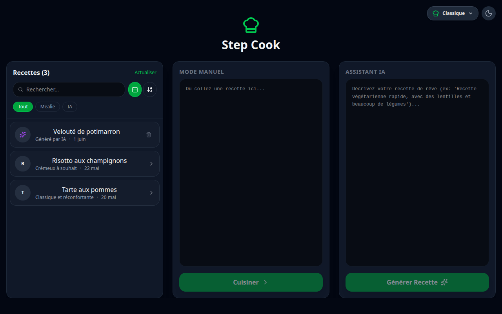
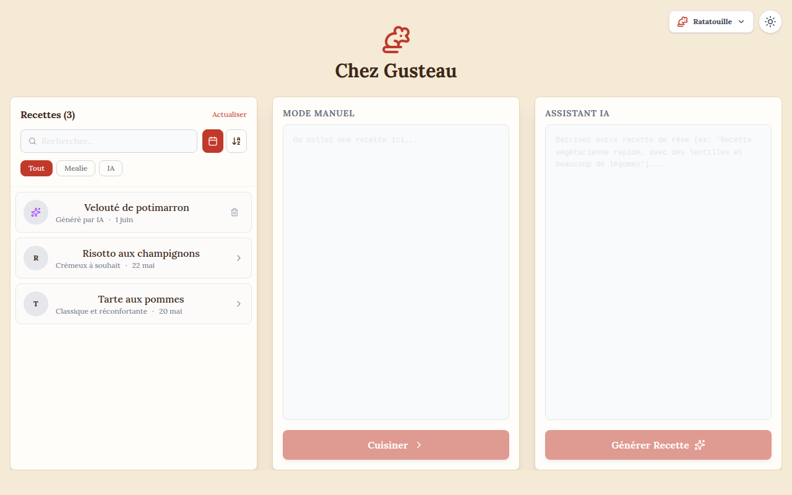
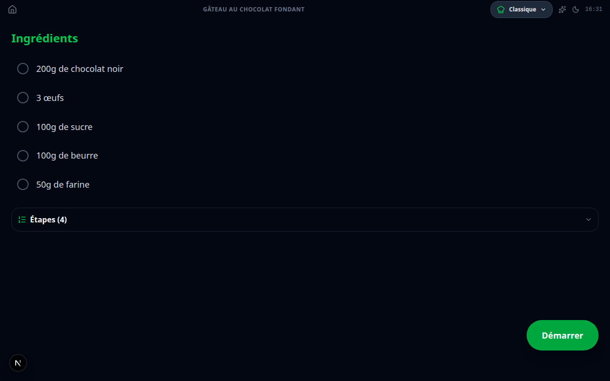
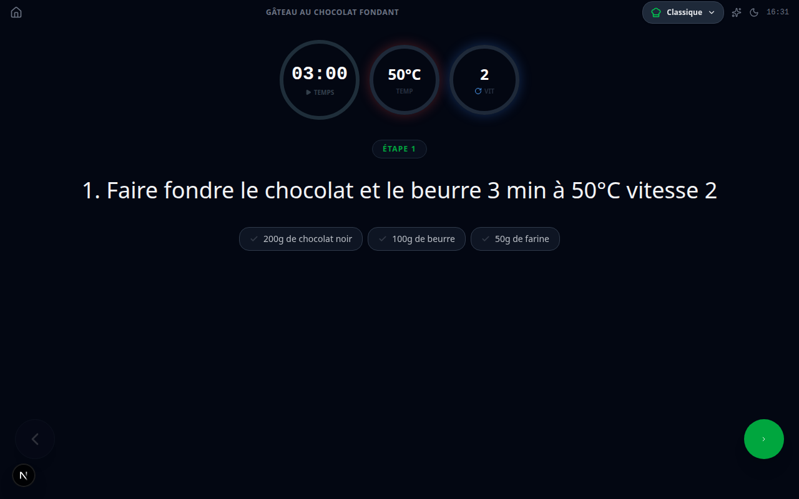

# Step Cook

Application de cuisine interactive pour **robots de cuisine**, construite avec
Next.js. Suivez n'importe quelle recette pas à pas avec timer, température,
vitesse et sens inverse — collée à la main, importée depuis Mealie ou générée
par IA.

## Pourquoi ?

Les robots de cuisine ont souvent un écosystème fermé : sur le Thermomix par
exemple, importer ses propres recettes passe par un abonnement payant (Cookidoo).
Step Cook contourne cette limite — au lieu de se battre avec le petit écran du
robot, on affiche la recette en mode pas-à-pas sur le **smartphone posé à côté**,
avec les paramètres (temps, température, vitesse, sens inverse) extraits
automatiquement à chaque étape.

## Captures d'écran

| Accueil | Thème « Chez Gusteau » (mode clair) |
|---|---|
|  |  |

| Aperçu de la recette (mobile) | Étape de cuisson (mobile) |
|---|---|
|  |  |

> Captures générées automatiquement par Playwright (`npm run test:e2e:screenshots`).

## Stack

- **Next.js 16** (App Router), **React 19**, **TypeScript**
- **Tailwind CSS 4**, icônes **lucide-react**
- **PWA** (manifest + service worker), thèmes pluggables, dark/light mode persistés
- Tests : **Jest** + Testing Library (unitaires) et **Playwright** (E2E)

## Démarrage

```bash
npm install
npm run dev        # http://localhost:4000
```

Le cœur de l'app (coller une recette → pas-à-pas) fonctionne **sans aucune
configuration**.

### Services externes (optionnels)

Ces intégrations sont **facultatives** et se dégradent proprement si elles ne
sont pas configurées (la colonne correspondante affiche un état vide/erreur, le
reste de l'app continue de fonctionner) :

| Service | Rôle | Variables |
|---|---|---|
| **Mealie** | Importer ses recettes depuis une instance Mealie auto-hébergée | `MEALIE_BASE_URL`, `MEALIE_API_TOKEN`, `MEALIE_CF_COOKIE` |
| **Gemini** | Générer / adapter des recettes par IA | `GEMINI_API_KEY` |
| **Firebase Firestore** | Sauvegarder les recettes générées par IA | `FIREBASE_SERVICE_ACCOUNT_*` |

Détail des variables d'environnement : voir [`CLAUDE.md`](CLAUDE.md).

## Commandes

```bash
npm run dev                    # Serveur de dev (port 4000)
npm run build                  # Build production
npm run lint                   # ESLint
npm test                       # Tests unitaires (Jest)
npm run test:e2e               # Tests end-to-end (Playwright)
npm run test:e2e:ui            # Playwright en mode UI
npm run test:e2e:screenshots   # (Re)génère les captures du README
```

## Tests E2E (Playwright)

Les tests E2E couvrent le flux **mode manuel** (100 % côté client, sans service
externe) : rendu de l'accueil, parsing d'une recette, navigation entre étapes,
extraction des paramètres du robot, et persistance du thème / dark mode. Les
routes Mealie et Firestore sont **mockées** pour des tests déterministes.

> ℹ️ Playwright tourne contre un **build de production** (`next start`), pas le
> serveur de dev — rendu réel et captures sans l'indicateur de dev Next.js. Il
> utilise le **Chrome système** (`channel: 'chrome'`), donc Google Chrome doit
> être installé.

## Architecture

Voir [`CLAUDE.md`](CLAUDE.md) pour le détail de l'arborescence, du flux de
données des recettes (Gemini / Mealie / manuel / Firestore) et du parsing des
paramètres du robot.
