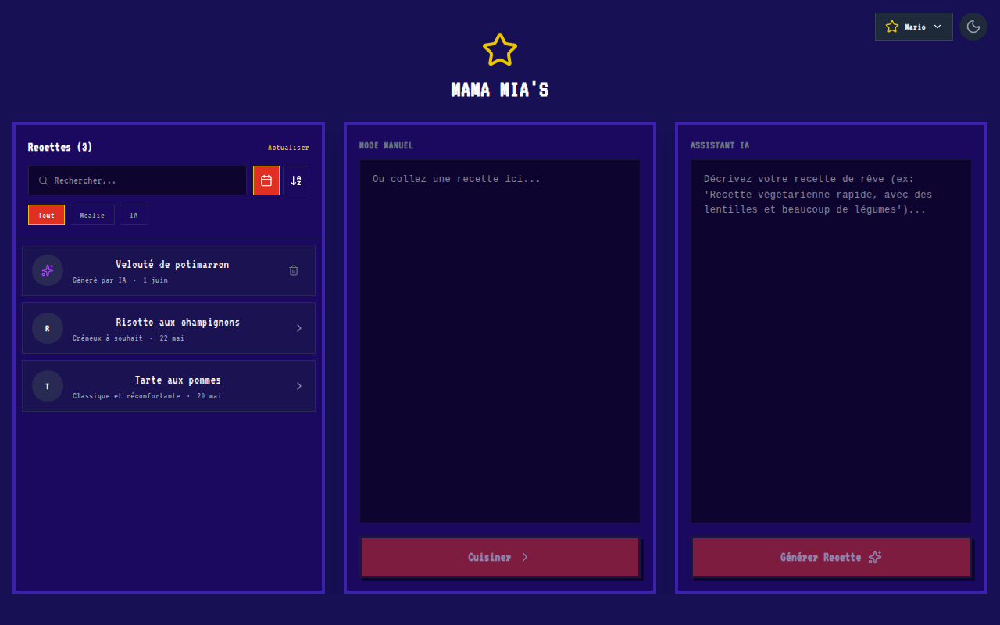

# Step Cook

Application de cuisine interactive pour **Thermomix**, construite avec Next.js.
Suivez une recette pas à pas avec timer, température, vitesse et sens inverse —
depuis Mealie, l'IA (Gemini) ou en collant simplement du texte.

## Captures d'écran

| Accueil | Aperçu de recette |
|---|---|
|  |  |

| Étape de cuisson (timer + Thermomix) | Thèmes pluggables (ex. Mario) |
|---|---|
|  |  |

> Les captures sont générées automatiquement par Playwright (`npm run test:e2e:screenshots`).

## Stack

- **Next.js 16** (App Router), **React 19**, **TypeScript**
- **Tailwind CSS 4**, icônes **lucide-react**
- **Google Gemini** (génération / modification de recettes)
- **Mealie** (gestionnaire de recettes auto-hébergé) + **Firebase Firestore**
- **PWA** (manifest + service worker), thèmes pluggables, dark/light mode
- Tests : **Jest** + Testing Library (unitaires) et **Playwright** (E2E)

## Démarrage

```bash
npm install
npm run dev        # http://localhost:4000
```

Variables d'environnement attendues dans `.env.local` : voir [`CLAUDE.md`](CLAUDE.md).

## Commandes

```bash
npm run dev                    # Serveur de dev (port 4000)
npm run build                  # Build production
npm run lint                   # ESLint
npm test                       # Tests unitaires (Jest)
npm run test:e2e               # Tests end-to-end (Playwright)
npm run test:e2e:ui            # Playwright en mode UI
npm run test:e2e:screenshots   # (Re)génère les captures du README
```

## Tests E2E (Playwright)

Les tests E2E couvrent le flux **mode manuel** (100 % côté client, sans service
externe) : rendu de l'accueil, parsing d'une recette, navigation entre étapes,
extraction des paramètres Thermomix, et persistance du thème / dark mode. Les
routes Mealie et Firestore sont **mockées** pour des tests déterministes.

> ℹ️ Playwright utilise le **Chrome système** (`channel: 'chrome'`) car les
> Chromium empaquetés ne couvrent pas toutes les distributions. Assurez-vous
> d'avoir Google Chrome installé.

## Architecture

Voir [`CLAUDE.md`](CLAUDE.md) pour le détail de l'arborescence, du flux de
données des recettes (Gemini / Mealie / manuel / Firestore) et du parsing
Thermomix.
